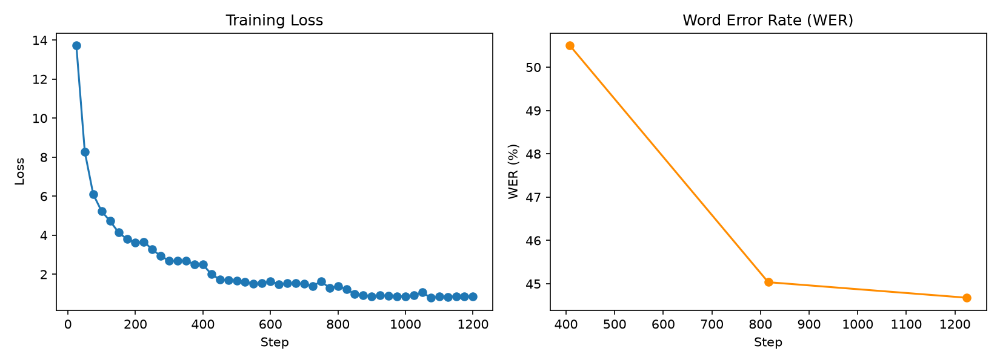
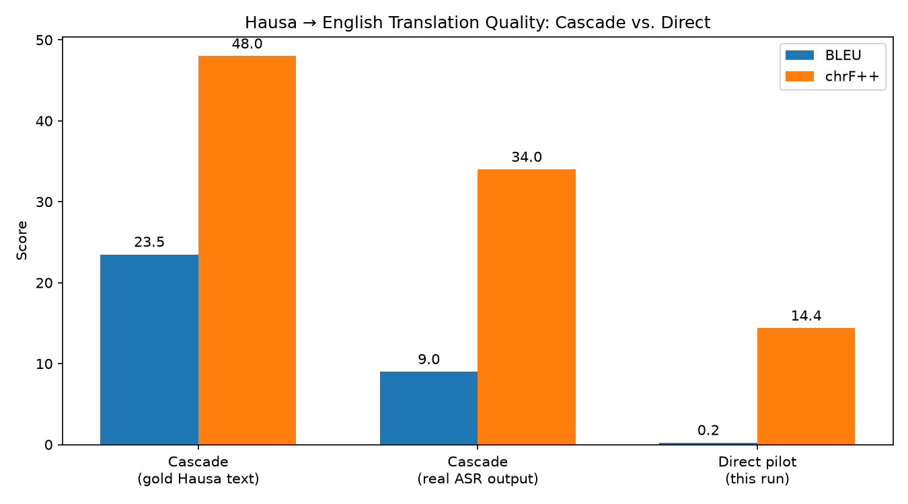
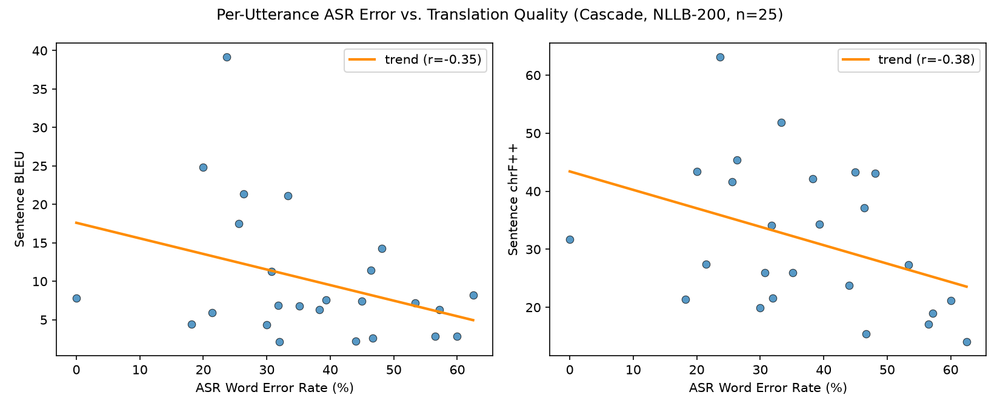

# Spoken-Language-Translation-Model
A Framework for Translating Hausa Audio Recordings into English Text

Collaborative Project with Nahom Azmach, Salim Gloyd, and Karun Mokha

## What this project does

The goal is to take a recording of someone speaking Hausa and get back written **English** text of what they said. There are two fundamentally different ways to build this, and this project builds and compares **both**:

- **A cascade** — two separate models chained together: one converts Hausa speech to Hausa text (Automatic Speech Recognition), the other translates that Hausa text to English. This is the project's main, fully-built pipeline — see **Part 1**.
- **A direct model** — one model that goes straight from Hausa audio to English text, with no Hausa-text step in between. Explored as a smaller-scale pilot, specifically to test whether skipping the written-Hausa step avoids a weakness we found in the cascade — see **Part 2**.

Both approaches start from the same idea: rather than building an ASR or translation model from nothing (which needs enormous amounts of data and compute), we take models already pretrained on speech and language in general — **Whisper** for speech, **NLLB** for translation — and adapt them specifically to Hausa. This is called **fine-tuning**.

We're using the smallest version of Whisper (`whisper-small`) throughout, so training can realistically happen on a single consumer GPU rather than needing a data center.

Below: general setup, then how each approach was built, then a head-to-head comparison of the two (**Part 3**).

## Where things stand right now

- Environment, GPU/CUDA support, and all dependencies: set up and confirmed working.
- **The cascade** (Hausa ASR fine-tune + NLLB-200 translation): fully built, trained, evaluated, and published. WER 44.7%, cascade translation BLEU ~8–10 on real ASR output. See **Part 1**.
- **The direct approach**: a first trained pilot is done and published. BLEU 0.24 on this small-scale pilot. See **Part 2**.
- **Head-to-head comparison and finding:** see **Part 3**.
- Notebook: covers both approaches and is Colab-ready, no local setup required — Sections 1–5 are the cascade (architecture, data, training telemetry, inference + translation demo), Sections 6–7 are the direct pilot and the results comparison.

## Phase 1 — Getting the machine ready

Before any training can happen, the machine needs Python, the ML libraries (PyTorch, Hugging Face's `transformers` and `datasets`, etc.), and `ffmpeg` (a tool used under the hood for handling audio).

The one detail worth understanding here: PyTorch (the library that actually does the math for training neural networks) can run either on the CPU or on the GPU. GPUs are built to do many small calculations at once, which happens to be exactly what training a neural network needs, so training on a GPU is often 10-50x faster than on a CPU. Our machine has an NVIDIA RTX 5050 GPU, so we made sure PyTorch was installed with CUDA support (CUDA is NVIDIA's software layer that lets programs like PyTorch talk to the GPU). Without this step, all the later training would silently run on the CPU and take drastically longer.

## Phase 2 — The notebook

Alongside the plain Python scripts, we built `capstone_demo.ipynb`, a Jupyter notebook that walks through both approaches interactively, with charts, playable audio, and runnable models instead of just terminal output. There are two reasons for having both a notebook and standalone scripts:

- **The scripts (`data_prep.py`, `train.py`, `inference.py`) are the cascade's "real" pipeline** — meant to be run as-is, in order, to actually produce a trained model.
- **The notebook is for exploring and explaining** what's happening at each stage, and it's built to run on Google Colab, not just locally. Not everyone on the team has a GPU on their own machine, and Colab provides free (if limited) GPU access in a browser. The very first cell in the notebook is a Colab compatibility check: if it detects it's running on Colab, it installs all the needed libraries automatically, since Colab doesn't come with them preinstalled the way our local environment does.

The notebook has seven sections: Sections 1–5 cover the cascade (an architecture overview, audio exploration, data pipeline verification, training telemetry, and interactive inference), and Sections 6–7 cover the direct pilot (a runnable demo of the trained direct model, and a head-to-head results comparison against the cascade).

## Part 1: The Cascade Approach

### Getting and preparing the data (`data_prep.py`)

A model can't learn from raw audio and raw text directly — both need to be converted into a numeric form it can actually process.

**The dataset:** we're using Hausa speech clips from Google's FLEURS dataset (specifically its `ha_ng` — Hausa, Nigeria — portion), each clip paired with its correct written transcription. The original project plan called for a different dataset (Mozilla's Common Voice), but Mozilla moved that dataset off the platform we were pulling it from in October 2025, so we switched to FLEURS, which contains a comparable set of Hausa recordings and is freely accessible.

**Turning audio into numbers (mel-spectrograms):** raw audio is just a long list of amplitude values over time, which isn't a great format for a model to learn patterns from. Instead, we convert each clip into a **mel-spectrogram** — essentially a picture of the audio, showing which frequencies (pitches) are present at each moment in time, on a scale that roughly matches how human hearing perceives pitch. This is the same format Whisper was originally trained on, so it's the format it expects.

**Turning text into numbers (tokenization):** similarly, the written Hausa transcription for each clip is broken into small chunks (tokens) and converted into a sequence of numbers, using the same vocabulary Whisper already knows. This is what the model is being asked to predict, one token at a time, from the audio.

After this conversion, everything is saved to a `./data` folder (a training set and a separate held-out test set) so training doesn't have to redo this conversion work every time.

### Training setup (`train.py`)

This is where the actual learning happens: showing the model many examples of (audio in → correct text out) and adjusting its internal parameters so its predictions get closer to being right.

A few choices worth explaining:

- **Batch size and gradient accumulation:** ideally, a model looks at many examples at once per learning step, since that gives a more stable sense of "which direction to adjust in." But more examples at once also means more GPU memory. Our GPU has a limited 8GB of memory, so we process only 2 clips at a time, but accumulate the learning signal over 4 of those small batches before actually updating the model — approximating a batch of 8 without needing the memory for 8 at once.
- **Mixed precision (fp16):** normally numbers inside the model are stored with high precision, using more memory and compute than usually necessary. We tell the training to use lower-precision numbers where it's safe to do so, which roughly halves memory use and speeds things up, with a negligible effect on the end result.
- **Measuring progress (Word Error Rate):** after each pass through the data, the model is asked to transcribe some clips it wasn't trained on, and we compare its output to the correct answer using **Word Error Rate (WER)** — essentially, what percentage of words were inserted, deleted, or substituted incorrectly. Lower is better. A WER of 0% would mean perfect transcription.

Before committing to a full run, we first verified this setup with a short trial (a couple of steps on a handful of examples) to confirm nothing was broken, then ran full training: 3 complete passes over all ~3,259 training clips on the local GPU, taking about 4.3 hours. Training loss dropped steadily the whole way — from 13.7 at the start down to 0.86 by the end — and WER on the held-out test set improved with each pass: 50.5% after epoch 1, 45.0% after epoch 2, and **44.7%** after epoch 3. That means the fine-tuned model gets a bit under half the words right on speech it never saw during training, a solid result for 3 epochs on a comparatively small, low-resource-language dataset.

### Trying the model out, and translating to English (`inference.py`)

Once a model is trained, `inference.py` is the piece that makes it actually useful: give it a path to a `.wav` audio file, and it returns the transcribed Hausa text. It loads the fine-tuned model, converts the given audio into the same mel-spectrogram format used during training (so the model sees data in the format it expects), and asks the model to generate a text prediction.

We first validated the mechanics (loading, audio conversion, generation, decoding back to text) using the base, not-yet-fine-tuned Whisper model — its output was recognizably in the right neighborhood phonetically but not accurate, as expected for a model that hadn't seen Hausa yet. Now that training is complete, `inference.py` and the notebook load the actual fine-tuned model.

The fine-tuned model is published on the **Hugging Face Hub** at [nahomazmach/whisper-small-ha](https://huggingface.co/nahomazmach/whisper-small-ha), rather than only existing as a ~1GB folder on one laptop. That means anyone — a groupmate, the Colab notebook, a grader — can load it directly with `WhisperForConditionalGeneration.from_pretrained("nahomazmach/whisper-small-ha")` and get real transcriptions immediately, without needing to run any of the training themselves.

**Getting to English:** the project's original goal was Hausa audio → **English** text, not just Hausa text. Rather than training one giant model to do both jobs at once, `inference.py` **chains a second, separate pretrained model** onto the output of the first:

```
[ Hausa audio ] → (our fine-tuned Whisper) → [ Hausa text ] → (NLLB-200) → [ English text ]
```

Meta's **NLLB-200** ([`facebook/nllb-200-distilled-600M`](https://huggingface.co/facebook/nllb-200-distilled-600M)) is a pretrained text-to-text translation model that explicitly supports Hausa→English, so this required no additional training — just loading a second model and adding one more `generate()` call. This "cascaded" ASR + MT setup is the standard architecture most production speech-translation systems actually use, rather than one end-to-end audio-to-foreign-text model. `inference.py` exposes `transcribe_and_translate()`, returning both the Hausa transcription and its English translation.

The notebook's Section 5 does a related but more visual version of this: it downloads both models, runs 5 examples from the held-out test set through the full cascade, and displays a table with the correct Hausa transcription, our model's Hausa prediction, the WER score, and the English translation for each one — a quick, human-readable way to see quality on real examples.

### Cascade Results

| Metric | Epoch 1 | Epoch 2 | Epoch 3 (final) |
|---|---|---|---|
| Eval WER | 50.5% | 45.0% | **44.7%** |
| Eval loss | 0.750 | 0.702 | 0.712 |



**What this picture is showing, in plain terms:** the left chart is the model's **training loss** — a single number that measures "how wrong is the model right now," calculated after every batch of examples it sees. It starts high (the model knows nothing about Hausa yet) and drops fast, then levels off — that flattening-out is normal and expected; it means the model has learned most of what it's going to learn from this amount of data, and further big improvements would need either more data or more training time. The right chart is **WER**, checked three times (once per epoch, i.e. once per full pass through the training data) on audio the model never trained on — it's the real test of whether the model actually got better, not just memorized the training examples. Both charts agreeing (loss down, WER down) is a good sign: the model is really learning to transcribe Hausa, not just overfitting.

Trained model: [nahomazmach/whisper-small-ha](https://huggingface.co/nahomazmach/whisper-small-ha) on the Hugging Face Hub.

**A concrete before/after**, on the same held-out test clip used again in Part 2 below, for direct comparison:

- **Ground truth:** *An kwatanta faretin gine-ginen da ke yin sararin samaniyar Hong Kong da ginshiƙi mai walƙiya wanda aka bayyana ta gaban ruwan Victoria Harbor.*
- **Base Whisper (untrained on Hausa):** *Aung kwa tanta ferietun ginaginang deke yung sarulin samania Hong Kong dekin shiki mei wal kiya wan da akabayenata gabung ruwan Victoria Habo.*
- **Fine-tuned model (Hausa text):** *An kwatanta, feryatin gina-ginan da ke yin tsarin samaniya, Hong Kong, da ginshiki mai walƙiya wanda aka bayyana ta gaban ruwan Victoria Harbour.*
- **Cascade's English translation (fine-tuned Hausa → NLLB-200):** *"The crystal structure of the skyline, Hong Kong, and the sparkling column that is depicted by the Victoria Harbour waterfront are illustrated."* — a bit awkwardly phrased, but the meaning (Hong Kong's skyline, glittering buildings, Victoria Harbour) comes through clearly, even after passing through our imperfect Hausa ASR output first.

The base model is barely phonetically related to the correct answer; the fine-tuned model gets nearly every word right. That gap is what the 3 epochs of training actually bought us.

## Part 2: The Direct Approach (Pilot)

The cascade above works and gets the meaning across, but its phrasing can be awkward, especially when it's translating our ASR model's own transcription errors rather than clean Hausa text — errors compound across the two chained models. That raises an obvious question: what if we skip the written-Hausa step entirely, and train a single model to go straight from Hausa audio to English text?

```
[ Hausa audio ]  →  (Whisper encoder/decoder, task="translate", LoRA-adapted)  →  [ English text ]
```

**What we built:** a teammate (Salim) had already set up infrastructure for exactly this on a separate branch (`feature/direct-s2tt`) — a LoRA fine-tune of `openai/whisper-small` in its `task=translate` mode (Whisper natively supports outputting English directly, since it was originally trained on translation pairs alongside transcription), trained on real Hausa-audio-to-English-text pairs from [McGill-NLP/NaijaS2ST](https://huggingface.co/datasets/McGill-NLP/NaijaS2ST) (a dataset with genuine English translations, unlike FLEURS which only has Hausa text). Rather than duplicating that work, we ran it: the branch's training code would have downloaded NaijaS2ST's entire ~69GB train split before using any of it, so we first used its own metadata-only audit tooling to find which 2 of its 115 data shards contained the most usable pairs, downloaded only those (a few GB instead of 69GB), and trained a real pilot. Along the way we found and fixed three real bugs (a file-path bug, a `transformers` version incompatibility, and an unreliable duration field in the dataset's own metadata). Full write-up, the exact scripts run, and reproduction steps are in [`direct_pilot/RESULTS.md`](direct_pilot/RESULTS.md).

**Training:** 256 training examples, 50 steps (3.125 epochs), LoRA — meaning only a small add-on set of weights (1.77 million parameters, 0.7% of the model's 243 million total) gets trained, while the base model stays frozen. Training loss averaged 30.98; validation loss came out to 4.04.

**Measuring translation quality (BLEU and chrF++):** WER (used for the cascade above) doesn't apply here, since we're not checking whether individual transcribed words match a script — we're comparing two English sentences for meaning. Instead we use two standard machine-translation metrics: **BLEU** compares chunks of consecutive words between the model's output and the correct answer (higher = closer phrasing), and **chrF++** does something similar at the character level, which tends to be a bit more forgiving of minor wording differences. Both range from 0 (no overlap) to 100 (a perfect match) — real translations, even good ones, often score in the 30s–40s, since there's more than one correct way to phrase a sentence.

**The same test clip as Part 1, this time through the direct model:**

- **Ground truth:** *An kwatanta faretin gine-ginen da ke yin sararin samaniyar Hong Kong da ginshiƙi mai walƙiya wanda aka bayyana ta gaban ruwan Victoria Harbor.*
- **Direct pilot's English output:** *"The government has been working on the development of the Hong Kong-based economic system in the region, which is the only way to help the country win the war."*

Fluent-sounding English — grammatically fine — but essentially unrelated to the actual content. That's what a validation BLEU of 0.24 looks like in practice: the model has learned to produce plausible English sentences, but hasn't learned to actually translate Hausa yet.

The pilot model is published on the Hugging Face Hub at [nahomazmach/whisper-small-ha-en-direct-pilot](https://huggingface.co/nahomazmach/whisper-small-ha-en-direct-pilot) — see the notebook's Section 6 for a runnable demo using this exact clip.

**Caveats, stated plainly:** this pilot's validation score is measured on a split derived from NaijaS2ST's train data, not the same official held-out `dev` examples the cascade's BLEU 8–10 was measured on — for a fully rigorous side-by-side, this checkpoint should be re-evaluated on that same set. And 256 training examples is far below what a direct model realistically needs to be competitive — this is a feasibility pilot, not a final verdict on cascade vs. direct as paradigms. See Part 3 below for what this does and doesn't tell us.

## Part 3: Cascade vs. Direct — Head to Head

Both approaches, scored on the same kind of task — translating Hausa to English — using BLEU and chrF++ (see Part 2 for what these mean):

| System | BLEU | chrF++ |
|---|---|---|
| Cascade, gold Hausa text (translation quality alone, no ASR errors) | ~22–25 | ~46–50 |
| Cascade, real ASR output (the actual end-to-end pipeline) | **~8–10** | **~33–35** |
| Direct pilot | **0.24** | **14.39** |



**What this picture is showing, in plain terms:** three bars, and for each one, taller = better. The first two bars are both *the same cascade model* — the only thing that changed between them is whether NLLB got to translate the *correct* Hausa text (left bar) or the Hausa text our imperfect ASR actually produced, mistakes and all (middle bar). The height drops by more than half just from that one change — that's the entire "ASR error propagation" story in one picture: the translation model itself didn't get worse, its *input* did. The third bar is a completely different, much smaller experiment (the direct pilot) — much shorter, for reasons explained above.

**This is a real, legitimate finding:** at small scale, the direct approach underperforms the cascade substantially, suggesting the cascade's advantage from independent massive pretraining (Whisper's 680k hours, NLLB's large parallel-text corpus) outweighs its ASR-error-propagation weakness — at least until a direct model gets enough paired data to compete. This isn't a verdict that direct approaches are worse in general — it's evidence that, in a genuinely low-resource setting like this one, the data-efficiency advantage of a cascade built from two separately pretrained giants currently matters more than avoiding error propagation. A cascade gets to reuse two models that already understand speech and language broadly; a direct model has to learn the entire audio-to-English mapping from whatever paired data it's given, and 256 examples just isn't enough of that yet.

The gold-vs-real-ASR gap in the cascade's own row is also worth sitting with on its own: it's the reason Part 2 got explored in the first place, and we independently reproduced it on a separate random sample of NaijaS2ST (BLEU ~22→10, chrF++ ~48→34) — the drop is real and repeatable, not a one-off pilot artifact.

**A closer, per-utterance look:** the bar chart above compares two big averages. This next chart zooms in — instead of one average number for "real ASR output," it plots all 25 individual test clips as separate dots, to check whether the pattern holds up clip-by-clip and not just on average.



**What this picture is showing, in plain terms:** each dot is one audio clip. A dot's position left-to-right is how many mistakes our ASR model made transcribing that specific clip (its **Word Error Rate** — 0% on the far left means a perfect transcription, 60% on the right means more than half the words were wrong). A dot's position up-or-down is how good the *English translation* of that same clip turned out (measured by BLEU on the left chart, chrF++ on the right — for both, higher = closer to the correct English answer). If ASR mistakes really do cause bad translations, we'd expect dots to drift downward as we move right — more transcription errors, worse translation — and that's roughly what the orange trend line shows: it slopes down in both charts.

It's not a perfectly clean line — a few clips with lots of ASR errors still translated decently, and vice versa, which is completely normal with real data and only 25 examples. The "**r**" number in the legend (called a *correlation coefficient*) is a standard way statisticians summarize how strongly two things move together in a single number: `r = 0` would mean no relationship at all, `r = -1` would mean a perfectly clean "more errors always means worse translation, every single time" relationship. Our r values (around -0.35 to -0.38) sit in between — a real, visible relationship, just not an ironclad rule for every individual clip. That's exactly what we'd expect: ASR errors are *a* major cause of bad translations, not the *only* one. See [`analysis/WER_VS_TRANSLATION_QUALITY.md`](analysis/WER_VS_TRANSLATION_QUALITY.md) and the notebook's Section 8 for more detail.

**What would make this comparison fully rigorous:** evaluating both systems on the exact same held-out NaijaS2ST `dev` examples (the direct pilot currently uses a derived validation split, not that official set), and training the direct model on substantially more than 256 examples before drawing conclusions about the paradigms in general rather than this specific pilot.

## Coming next

- Evaluate the direct pilot on the exact same held-out NaijaS2ST examples used for the cascade's BLEU 8–10 number, for a fully apples-to-apples comparison.
- Scale up the direct model's training data — the pilot used 256 examples out of NaijaS2ST's ~13,871 available pairs.
- Run a larger, randomized multi-speaker evaluation of the gold-vs-ASR translation gap (rather than the current 25-example pilot) to make that finding fully rigorous too.
- Revisit the training methodology: our current cascade WER is measured against the same FLEURS test split that was evaluated during training every epoch, rather than a completely held-out final partition — worth tightening up before treating 44.7% as a fully clean number.

## Notes
- ~~build the cascade model and a notebook. NA has already began the ASR portion. Extending it with NLLB?~~ Done — see Part 1 above.
- ~~build the direct s2tt model and a notebook. Speech Encoder-Text decoder Transformer~~ A first pilot is done — see Part 2 above (Whisper-based, LoRA-adapted; a separate XLS-R+mBART variant is being explored by a teammate as further future work).
- Our final submission should be a ipnyb file that include the outputs from both notebooks, comparing the architectures
- focusing on hausa due to the amount of available data, with an intent to make this applicable to all spoken languages later. Note that hausa is a tonal language
- note the difference between ASR vs speech encoder
