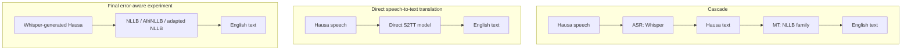

# Plain-Language Project Glossary

This glossary explains the speech-processing, machine-learning, experimental,
statistical, computing, and reproducibility terms used in this repository. It
is written for readers who understand the general idea of artificial
intelligence but may not have a background in speech or translation research.

Some terms have a special meaning in this project. In particular, **noisy**
usually means errors in ASR-generated Hausa text—not background sound in the
audio—and the final controlled experiment used NaijaS2ST `train` for training
and internal validation, then observed NaijaS2ST `dev` for its completed final
evaluation. That `dev` split is no longer an untouched future tuning set.

## 1. Speech and translation

### 1. ASR — Automatic Speech Recognition

Technology that converts spoken language into written text in the same
language. ASR is transcription, not translation.

**In this project:** the fine-tuned Whisper model converts Hausa speech into
Hausa text before that text is passed to NLLB in the cascade.

See also: [Cascade](#2-cascade--cascaded-system), [Transcription](#12-transcription),
[WER](#76-wer--word-error-rate).

### 2. Cascade / cascaded system

A pipeline made from separate systems whose outputs and inputs are connected.
Each stage can be trained, replaced, and evaluated independently.

**In this project:** Whisper performs Hausa ASR, then NLLB or AfriNLLB
translates the resulting Hausa text into English. ASR errors can therefore
propagate into the MT stage.

### 3. Direct S2TT / direct speech translation

A speech-to-text translation system that generates target-language text
directly from source-language audio during inference. It does not call a
separate source-language ASR system followed by a separate text translator.

**In this project:** the direct pilot applies a LoRA adapter to Whisper's
translation mode to map Hausa audio to English text. Whisper still contains an
encoder and decoder internally; “direct” describes the overall inference
graph, not the absence of internal components.

### 4. End-to-end

A system that learns or performs the full mapping from original input to final
output without requiring separately operated intermediate stages.

**In this project:** direct Hausa-audio-to-English-text translation is the
end-to-end alternative to the ASR-to-MT cascade. The term does not guarantee
that every component was trained from scratch or jointly.

### 5. Error propagation

The process by which an upstream system's mistakes become input to a later
system and reduce downstream performance.

**In this project:** missing, inserted, or substituted Hausa words from ASR may
cause NLLB to generate a worse English translation, even when NLLB itself has
not changed.

### 6. Inference

Using a trained model to generate a prediction without updating its learned
parameters. Inference is what happens when a user supplies new audio or text
after training.

**In this project:** inference may mean Whisper transcription, NLLB
translation, the complete cascade, or direct audio-to-English generation.

### 7. MT — Machine Translation

Automatic translation of written text from one language to another.

**In this project:** MT is the second part of the cascade and converts gold or
ASR-generated Hausa text into English with NLLB, AfriNLLB, or an adapted NLLB
model.

### 8. Audio feature extraction / log-Mel spectrogram

Feature extraction converts a waveform into numeric values that make useful
speech patterns easier for a model to process. A Mel spectrogram describes
frequency energy over time using a scale inspired by human pitch perception;
Whisper uses logarithmically scaled Mel features.

**In this project:** `WhisperProcessor` performs this conversion before audio
reaches Whisper. The notebook's plotted Mel spectrogram is converted to a
decibel scale, so “Mel-spectrogram” and “log-Mel spectrogram” refer to closely
related representations rather than two unrelated inputs.

### 9. Sampling rate / 16 kHz

Sampling rate is the number of waveform measurements stored per second. A
rate of 16 kHz means 16,000 audio samples per second.

**In this project:** audio is resampled to 16 kHz when necessary because that
is the sampling rate expected by Whisper's feature extractor.

### 10. Speech translation

Translation whose original input is speech and whose output is text or speech
in another language. It combines challenges from speech recognition and
translation.

**In this project:** both the cascade and the direct model perform Hausa speech
translation, although they reach English text through different inference
graphs.

### 11. S2ST versus S2TT

**S2ST** means speech-to-speech translation: speech in one language becomes
speech in another. **S2TT** means speech-to-text translation: speech becomes
translated written text.

**In this project:** NaijaS2ST is the dataset's name, but the repository's
implemented systems currently produce English text and are therefore S2TT
systems.

### 12. Transcription

A written representation of spoken words, normally in the same language as
the recording. Translation changes the language; transcription does not.

**In this project:** the gold Hausa text and Whisper's Hausa output are both
transcriptions, while NLLB's English output is a translation.

### 13. Utterance

One recorded speech example, commonly a single sentence or short segment. An
utterance is a unit of data rather than a guarantee of a particular linguistic
boundary.

**In this project:** multiple utterances from different speakers can share an
`alignment_id` when they express the same underlying sentence.

### 14. Waveform / mono downmix

A waveform records how sound amplitude changes over time. Mono audio has one
channel, while stereo or multi-channel audio has more than one.

**In this project:** multi-channel input is averaged across channels, or
“downmixed,” before resampling and Whisper feature extraction.

## 2. Models and architecture

### 15. AfriNLLB

An Africa-specialized machine-translation checkpoint derived from the NLLB
model family.

**In this project:** `AfriNLP/AfriNLLB-12enc-12dec-full-ft` is compared with
generic NLLB to test whether African-language specialization alone improves
Hausa-to-English translation and robustness to ASR output.

### 16. Attention / self-attention / cross-attention

Attention lets a model assign different importance to different sequence
positions while building a representation or prediction. Self-attention
connects positions within the same sequence; cross-attention lets a decoder
consult an encoder's representation.

**In this project:** Whisper and NLLB are Transformer models whose encoder and
decoder blocks rely on these mechanisms.

### 17. Autoregressive decoding

Generating a sequence one token at a time, with each new prediction conditioned
on the tokens already generated.

**In this project:** Whisper and NLLB generate transcription or translation
tokens sequentially until they reach a stopping condition.

### 18. Base model / model checkpoint

A **base model** is the starting pretrained network used for adaptation. A
**checkpoint** is a particular saved state of a model or adapter at a point in
training or publication.

**In this project:** `openai/whisper-small` is the direct pilot's base model,
while the published LoRA adapter and `nahomazmach/whisper-small-ha` represent
project-specific saved states.

### 19. Beam search

A decoding method that keeps several promising partial token sequences at
each generation step instead of keeping only the current best sequence.

**In this project:** the MT evaluator uses four beams, while the direct pilot
demonstration uses one beam. Beam settings affect speed and output and should
be held constant in controlled comparisons.

### 20. Conv1D / convolutional layer

A convolutional layer detects local patterns by applying small learned filters
across neighboring input positions. Conv1D operates along one dimension, such
as time.

**In this project:** Whisper begins its encoder with two Conv1D layers that
process nearby audio-feature frames before the Transformer blocks.

### 21. Decoder

The part of an encoder–decoder model that produces the output sequence. It can
use previous output tokens and information from the encoder.

**In this project:** Whisper's decoder produces Hausa or English tokens, while
NLLB's decoder produces English translation tokens.

### 22. Encoder

The part of an encoder–decoder model that converts an input sequence into
contextual numeric representations.

**In this project:** Whisper's encoder processes audio features, whereas
NLLB's encoder processes tokenized Hausa text.

### 23. Generation

The prediction process in which a model chooses a sequence of output tokens.
Generation can be controlled by settings such as language tokens, maximum
length, and beam count.

**In this project:** Transformers' `generate()` method is used for ASR, direct
S2TT, and NLLB translation.

### 24. NLLB / NLLB-200

No Language Left Behind is Meta's multilingual text-translation model family.
NLLB-200 was designed to cover roughly 200 languages.

**In this project:** the principal MT checkpoint is
`facebook/nllb-200-distilled-600M`; an optional stronger baseline uses the
3.3B-parameter checkpoint.

### 25. Omnilingual-ASR

Meta's highly multilingual automatic-speech-recognition model family, designed
for broad language coverage and adaptation.

**In this project:** the optional `omniASR_LLM_1B` baseline generates Hausa
transcripts in the same manifest format as Whisper so the downstream MT
comparison can hold other components constant.

### 26. Pretrained model

A model whose parameters were learned from a large earlier dataset before it
was used for the current task.

**In this project:** pretraining makes the work feasible on limited hardware;
the team adapts Whisper and NLLB rather than learning speech and translation
from random initialization.

### 27. Seq2Seq / encoder–decoder model

A sequence-to-sequence model transforms one ordered sequence into another,
often using an encoder to understand the input and a decoder to generate the
output.

**In this project:** Whisper maps audio-feature sequences to text tokens, and
NLLB maps Hausa token sequences to English token sequences.

### 28. Token / tokenizer / tokenization / vocabulary

A token is a unit of text represented by a numeric ID. Tokenization divides
text into tokens, the tokenizer performs that mapping, and the vocabulary is
the model's known set of token IDs and pieces.

**In this project:** Whisper and NLLB use different tokenizers and special
language/task tokens to control transcription and translation.

### 29. Transformer

A neural-network architecture built mainly around attention mechanisms for
processing and generating sequences.

**In this project:** Whisper is an audio-to-text Transformer, while NLLB and
AfriNLLB are text-to-text Transformers.

### 30. Whisper / Whisper-small

Whisper is OpenAI's multilingual speech-recognition and speech-translation
model family. “Small” identifies one model size, not a project-specific
quality judgment.

**In this project:** `openai/whisper-small` is the pretrained base;
`nahomazmach/whisper-small-ha` is the Hausa-ASR checkpoint; and the direct
pilot attaches an English-translation LoRA adapter to the base model.

## 3. Data and datasets

### 31. Alignment / `alignment_id`

An alignment connects corresponding content across languages or recordings.
The project's `alignment_id` represents one underlying Hausa–English sentence
pair.

**In this project:** the preparation code strips expected `H` and `E` language
prefixes from NaijaS2ST text IDs to create a shared key. Recordings with the
same key stay in the same internal split.

### 32. Common Voice

Mozilla Common Voice is a community-contributed multilingual speech dataset.

**In this project:** it appears in the original plan but is historical rather
than current. The implemented ASR training pipeline uses FLEURS because the
original Hugging Face access path changed.

### 33. Corpus / parallel corpus

A corpus is a structured collection of language data. A parallel corpus
contains corresponding content in multiple languages, such as Hausa and
English versions of the same sentence.

**In this project:** parallel Hausa–English data supports MT evaluation and
direct S2TT training.

### 34. Dataset revision / dataset shard

A dataset revision identifies a particular hosted version. A shard is one
storage file containing part of a dataset that is too large to keep in one
file.

**In this project:** revisions are recorded for reproducibility, while targeted
NaijaS2ST shards were used to avoid downloading the entire approximately
69-GB training split for the small direct pilot.

### 35. English reference

A human-provided English translation used as the expected comparison text for
automatic or human evaluation.

**In this project:** model predictions are compared with `english_ref` to
calculate BLEU, chrF++, and optional SSA-COMET scores.

### 36. FLEURS / `ha_ng`

FLEURS is Google's multilingual speech dataset. `ha_ng` is its Hausa as spoken
in Nigeria configuration.

**In this project:** FLEURS trains and tests Hausa ASR and provides qualitative
audio demonstrations. Its Hausa transcript is not automatically an English
translation reference for Hausa-to-English S2TT scoring.

### 37. Gold transcript / gold Hausa

“Gold” data is the trusted human-provided reference rather than a model
prediction. It can still contain annotation limitations; the label describes
its role in the experiment.

**In this project:** `hausa_gold` is used as the ASR reference, the clean MT
training source, and the input to the gold-Hausa MT oracle.

### 38. Held-out data

Examples deliberately withheld from model training so they can estimate
performance on unseen data.

**In this project:** an internal validation split was held out from NaijaS2ST
`train`, and official NaijaS2ST `dev` stayed untouched until the completed final
GPU evaluation. It has now been observed and cannot serve as a new untouched
tuning set.

### 39. JSONL manifest

JSON Lines is a text format with one JSON record per line. A manifest is an
index describing examples and the fields needed to process them.

**In this project:** manifests contain fields such as `alignment_id`,
`speaker_id`, gold and ASR Hausa, the English reference, WER, and acoustic
metadata without necessarily embedding the audio itself.

### 40. Metadata

Information that describes data or an experiment rather than being the model's
primary audio, text, or weights.

**In this project:** metadata includes identifiers, duration, SNR, seed,
package versions, model revisions, hyperparameters, GPU information, and
evaluation configuration.

### 41. NaijaS2ST

A parallel Nigerian-language speech-translation dataset containing speech and
aligned text for Hausa, English, and other Nigerian languages, with multiple
speakers and accents.

**In this project:** NaijaS2ST supplies Hausa audio, gold Hausa, and English
references for error-propagation experiments, MT adaptation, and S2TT
evaluation.

### 42. `speaker_id` / `utterance_id`

A `speaker_id` identifies the person who produced a recording. An
`utterance_id` identifies one individual recorded example.

**In this project:** an utterance ID combines a NaijaS2ST user and text ID,
while speaker IDs are counted when reporting split composition and overlap.

### 43. Streaming dataset

A dataset read progressively as examples are requested rather than downloaded
and loaded completely in advance.

**In this project:** streaming permits metadata scans and selected audio
processing without automatically storing every NaijaS2ST shard locally.

### 44. Train / validation / dev / test split

Separate dataset portions assigned different experimental roles. Training data
updates parameters; validation data supports development or model selection;
test or held-out data supports final evaluation.

**In this project:** FLEURS uses `train` and `test`; the final NaijaS2ST study
created internal training/validation subsets from `train` and used official
`dev` only for the completed final benchmark.

## 4. Training and fine-tuning

### 45. Adapter

A compact learned component attached to a larger base model. An adapter lets a
project specialize a model without duplicating or changing all base weights.

**In this project:** LoRA adapters are trained for the direct Whisper pilot and
for clean, noisy, and mixed NLLB conditions.

### 46. Batch size / effective batch size

Batch size is the number of examples processed together in one forward/backward
pass. Effective batch size also counts small batches accumulated before a
parameter update.

**In this project:** batch size 2 with four accumulation steps gives an
effective batch size of 8; the OOM fallback uses batch size 1 with eight
accumulation steps to preserve that effective size.

### 47. Epoch

One complete pass through the selected training examples. The number of steps
in an epoch depends on the dataset, batch size, and accumulation behavior.

**In this project:** the completed Hausa ASR run and proposed controlled LoRA
runs use three epochs, while the 50-step direct pilot corresponds to about
3.125 passes over its small training subset.

### 48. Fine-tuning

Continuing training from a pretrained model so it becomes more specialized for
a language, task, or data distribution.

**In this project:** Whisper is fine-tuned for Hausa ASR, while LoRA provides a
parameter-efficient form of fine-tuning for direct S2TT and error-aware MT.

### 49. Frozen versus trainable parameters

Frozen parameters remain unchanged during training. Trainable parameters
receive gradient-based updates.

**In this project:** LoRA keeps the large base model frozen and trains a much
smaller set of added parameters, reducing memory and storage requirements.

### 50. Gradient

A calculated signal describing how changing a trainable parameter would change
the loss. Optimizers use gradients to choose parameter updates.

**In this project:** gradients are computed during fine-tuning and may be
accumulated across several small batches before an optimizer update.

### 51. Gradient accumulation

A memory-saving technique that adds learning signals from several small
batches before updating parameters.

**In this project:** it approximates a larger batch on an 8-GB GPU without
requiring all eight examples to be held in VRAM simultaneously.

### 52. Gradient checkpointing

A technique that stores fewer intermediate activations during training and
recomputes them when needed during backpropagation. It lowers memory use at the
cost of additional computation.

**In this project:** it is the documented fallback if LoRA training runs out of
VRAM.

### 53. Learning rate

The scale of parameter updates made by the optimizer. A rate that is too large
can destabilize training, while one that is too small can make learning slow or
ineffective.

**In this project:** controlled clean, noisy, and mixed conditions use the same
learning rate so this factor does not confound their comparison.

### 54. LoRA — Low-Rank Adaptation

A parameter-efficient technique that learns small low-rank updates inside
selected model layers instead of updating every original parameter.

**In this project:** LoRA targets attention projection layers in NLLB and
trains only a small fraction of the full model; the direct pilot trains about
1.77 million parameters, roughly 0.7% of its model total.

### 55. Loss / training loss / validation loss

A mathematical objective measuring disagreement between model predictions and
training targets. Lower is generally preferable for the same objective, but a
loss value is not a percentage of correct answers and is not always comparable
across models or datasets.

**In this project:** training loss guides updates, while validation loss is
used to select the best controlled MT checkpoint.

### 56. Mixed precision / FP16 / BF16

Mixed precision uses lower-precision numeric formats for many operations to
reduce memory and improve speed. FP16 and BF16 both use 16 bits but have
different numeric ranges and hardware support.

**In this project:** CUDA training chooses BF16 when PyTorch reports support,
otherwise FP16; CPU execution uses FP32.

### 57. PEFT — Parameter-Efficient Fine-Tuning

A family of methods that adapts a large model by training a small subset or an
added set of parameters.

**In this project:** LoRA is the selected PEFT method, and Hugging Face's
`peft` library saves and loads the resulting adapters.

### 58. Random seed

A number used to initialize pseudo-random operations so a randomized process
can be repeated more consistently.

**In this project:** seed 42 controls split shuffling, mixed-condition
selection, model training randomness, and bootstrap resampling where
specified.

### 59. Training step

One training iteration over a batch or accumulated set of batches. A step is
not the same as an epoch, which is a full pass over the data.

**In this project:** the direct pilot reports 50 steps, while full ASR training
reports losses and evaluations at many steps across three epochs.

### 60. Warmup

An early training period in which the learning rate gradually increases before
reaching its intended level. Warmup can reduce instability when adaptation
begins.

**In this project:** the ASR script uses explicit warmup steps, while the final
controlled MT script expresses warmup as a fraction of training.

## 5. Clean, noisy, and mixed experiments

### 61. ASR noise

Errors introduced when a speech recognizer converts audio into text. These can
include substitutions, deletions, insertions, corrupted names, missing
numbers, or hallucinated phrases.

**In this project:** ASR noise is primarily **textual recognition error**, not
background acoustic noise added to a recording.

### 62. Clean condition

The controlled MT condition trained with human-provided gold Hausa as its
source text.

**In this project:** it receives one clean Hausa→English example per eligible
training utterance and is selected against the same noisy validation
distribution as the other conditions.

### 63. Error-aware / noise-aware MT adaptation

Fine-tuning a translation model to handle the characteristic errors produced
by an upstream ASR system.

**In this project:** NLLB is adapted on clean, Whisper-generated, or mixed
Hausa input so the team can test whether downstream adaptation recovers
translation quality lost through ASR errors.

### 64. Exposure-matched

Experimental conditions are exposure-matched when they receive the same
number of training examples and comparable opportunities for parameter
updates.

**In this project:** clean, noisy, and mixed each produce exactly one MT
example per eligible input utterance, preventing mixed training from winning
simply because it sees twice as many rows.

### 65. Mixed condition

A training condition combining clean and ASR-generated source text.

**In this project's final controlled script:** approximately half of the
utterances use gold Hausa and half use Whisper Hausa, while every utterance
contributes only one training example. The older pilot script constructed
mixed data differently and is not the authoritative final definition.

### 66. Noisy condition / source distribution

The noisy condition uses ASR-generated source text rather than gold text. A
source distribution describes the proportions and characteristics of the
inputs presented to a model.

**In this project:** noisy training uses Whisper Hausa for every utterance,
and all three controlled models are validated on 100% Whisper-generated
Hausa to approximate cascade deployment conditions.

## 6. Evaluation metrics

### 67. ASR error types: substitution, deletion, insertion

A substitution replaces a reference word with another word; a deletion omits
a reference word; and an insertion adds a word that has no corresponding word
in the reference.

**In this project:** the counts and rates of all three are calculated and
correlated separately with sentence-level translation quality.

### 68. BLEU

An automatic translation metric based mainly on matching word n-grams between
model output and one or more reference translations, with a penalty for output
that is too short.

Higher BLEU usually indicates greater reference overlap under the same test
and configuration, but it is not a percentage of correct meaning and can miss
valid paraphrases.

### 69. chrF++

An automatic translation metric combining character n-gram precision and
recall with word n-gram information. Character-level comparison can be more
tolerant of inflectional and spelling variation than word-only matching.

Higher chrF++ indicates greater surface-form overlap with the reference; it is
not a literal percentage of translation correctness.

### 70. COMET / SSA-COMET

COMET is a learned translation-evaluation framework that uses a neural model
to predict quality from the source, translation, and—in reference-based
versions—the reference. Its scale depends on the particular checkpoint and is
not “percent correct.”

**In this project:** SSA-COMET is the optional checkpoint intended for
under-resourced Sub-Saharan African language evaluation. It is run after
prediction generation in a separate environment to avoid dependency conflicts.

### 71. Corpus-level versus sentence-level metric

A corpus-level metric calculates one score across the complete evaluation set.
A sentence-level metric scores individual examples and is usually much more
variable, especially for short sentences.

**In this project:** corpus BLEU and chrF++ are primary system summaries,
while sentence chrF++ supports correlations, WER bins, and qualitative
selection.

### 72. Corpus WER versus mean utterance WER

Corpus WER pools error counts across all reference words, so longer utterances
contribute more. Mean utterance WER calculates WER separately for every
recording and gives each recording equal weight in the average.

These values can differ even on the same predictions, so reports should label
which one they use.

### 73. N-gram

A sequence of `n` consecutive units. Word n-grams are sequences of words;
character n-grams are sequences of characters.

**In this project:** BLEU compares word n-grams, while chrF++ combines
character n-grams with word n-gram information.

### 74. Point estimate

The single metric value calculated from the observed evaluation sample before
expressing uncertainty.

**In this project:** each system's BLEU, chrF++, and optional SSA-COMET point
estimate is reported alongside cluster-bootstrap confidence intervals.

### 75. SacreBLEU

A standardized software implementation for computing reproducible BLEU,
chrF, chrF++, and related translation metrics. Its configuration determines
tokenization and other scoring details.

**In this project:** the `sacrebleu` Python library computes corpus BLEU,
corpus chrF++, sentence chrF++, and bootstrap scores.

### 76. WER — Word Error Rate

WER compares an ASR hypothesis with a reference transcript using:

`WER = (substitutions + deletions + insertions) / reference-word count`

Lower is better. Because insertions add errors without increasing the
reference-word denominator, WER can exceed 100% and should not be described
simply as the percentage of words the model “got wrong.”

### 77. WER bin

A range of WER values used to group examples for analysis.

**In this project:** utterances are placed into ranges such as `≤20`, `20–40`,
and `>80`, then mean sentence chrF++ is examined as ASR error increases.

## 7. Statistics

### 78. Bootstrap

A resampling method that repeatedly builds new samples from the observed data,
with replacement, and recalculates a statistic. The resulting distribution
helps estimate uncertainty without assuming a simple analytic distribution.

**In this project:** the default analysis runs 1,000 bootstrap resamples.

### 79. Bootstrap replicate

One resampled dataset and the metric result calculated from it. Many
replicates together form a bootstrap distribution.

**In this project:** the number of replicates and random seed are recorded in
the analysis metadata and confidence-interval output.

### 80. Cluster bootstrap

A bootstrap that samples groups, or clusters, rather than treating every row
as an independent item.

**In this project:** the cluster key is `alignment_id`; all recordings of a
sampled underlying sentence are included together. This avoids pretending
that related recordings of the same content are fully independent.

### 81. 95% confidence interval

An interval intended to communicate sampling uncertainty under a stated
method. It is not a guarantee that every future result lies inside the range.

**In this project:** the interval is the 2.5th to 97.5th percentile range of
the cluster-bootstrap metric distribution.

### 82. Effect size / bootstrap delta

Effect size describes the magnitude of a difference, which is distinct from
whether a statistical test labels that difference significant.

**In this project:** `mean_bootstrap_delta` summarizes the candidate system's
average paired score difference from the selected baseline across bootstrap
replicates.

### 83. Paired bootstrap difference / p-value

A paired comparison evaluates two systems on the same resampled examples, so
example difficulty is aligned. The difference distribution describes the
candidate's change relative to the baseline.

**In this project:** the two-sided bootstrap p-value is calculated from the
fractions of paired differences at or below and at or above zero. It is not the
probability that one model is true or that the result occurred “by chance.”

### 84. Pearson correlation / Pearson `r`

A number from −1 to +1 describing the direction and strength of a linear
relationship. Values near −1 indicate a strong negative linear relationship,
values near +1 a strong positive one, and values near zero little linear
relationship.

**In this project:** Pearson `r` relates WER and individual error rates to
sentence chrF++; correlation does not prove that one variable alone causes the
other.

### 85. Qualitative analysis

Human-readable examination of individual outputs to understand mistakes and
improvements that aggregate metrics may hide.

**In this project:** the script selects both the largest candidate gains and
largest regressions relative to NLLB, deduplicated by `alignment_id`, rather
than showing only successful examples.

## 8. GPU and compute

### 86. CPU / GPU

A CPU is a general-purpose processor. A GPU contains many parallel processing
units that can accelerate the tensor calculations used by neural networks.

**In this project:** lightweight preparation and analysis may run on CPU, but
large ASR generation and LoRA training are intended for a compatible GPU.

### 87. CUDA

NVIDIA's software platform for running general-purpose computations on
compatible NVIDIA GPUs.

**In this project:** a CUDA-enabled PyTorch installation is required before
expensive GPU stages; installing PyTorch alone does not guarantee that CUDA is
available.

### 88. Dependency / `requirements.txt`

A dependency is an external software package required by the project. A
requirements file records packages and sometimes compatible version ranges.

**In this project:** training, Omnilingual-ASR, and COMET have separate
requirements because they can need different or conflicting package versions.

### 89. NVIDIA GPU / VRAM

VRAM is the memory on a graphics processor used to hold model parameters,
inputs, activations, and temporary calculations.

**In this project:** the local RTX 5050 has 8 GB of VRAM, motivating small
batches, gradient accumulation, mixed precision, and optional gradient
checkpointing.

### 90. `nvidia-smi` / `torch.cuda.is_available()`

`nvidia-smi` is an NVIDIA command-line diagnostic that reports detected GPUs,
drivers, and memory. `torch.cuda.is_available()` reports whether the current
PyTorch process can use CUDA.

Both checks matter: a computer can have an NVIDIA GPU while a particular
Python environment still has CPU-only PyTorch or lacks driver access.

### 91. OOM — Out of Memory

An error raised when a process requests more CPU memory or GPU VRAM than the
system can supply.

**In this project:** documented responses include reducing batch size,
increasing gradient accumulation, enabling gradient checkpointing, or reducing
COMET evaluation batch size consistently where required.

### 92. PyTorch

An open-source machine-learning framework for tensor computation, automatic
differentiation, model execution, and training.

**In this project:** Whisper, NLLB, PEFT adapters, CUDA execution, and mixed
precision all run through PyTorch and Hugging Face libraries built on it.

### 93. Virtual environment / `venv`

An isolated Python environment with its own installed packages. It helps
prevent one project's dependency versions from changing another's.

**In this project:** separate GPU-training and COMET-analysis environments are
recommended because COMET may constrain or downgrade Transformers packages.

### 94. Cache

Local storage reused for previously downloaded models, datasets, or generated
files so repeated runs need less network transfer or computation.

**In this project:** Hugging Face model downloads are cached, but cache files
and large generated artifacts should not be committed to Git.

### 95. Google Colab / Jupyter notebook

A Jupyter notebook is an interactive document containing Markdown, executable
code cells, and outputs. Google Colab is a hosted notebook service that can
provide temporary CPU or GPU runtimes.

**In this project:** `capstone_demo.ipynb` explains and demonstrates the
cascade and direct pilot without requiring every reader to train the models.

## 9. Reproducibility and Git

### 96. Artifact

A file produced or consumed by an experiment, such as a manifest, model
checkpoint, adapter, prediction table, metric table, metadata record, or plot.

**In this project:** large generated artifacts are normally excluded from Git,
while selected small results and metadata may be committed after team review.

### 97. Branch

A named line of Git development that can contain changes not present on other
branches.

**In this project:** some direct-model infrastructure and historical experiment
work exist on side branches, while the glossary describes terminology found on
the inspected `main` branch.

### 98. Commit / commit SHA

A commit records a repository state and its history. A commit SHA is the
identifier used to refer to that exact recorded state.

**In this project:** handoff instructions record a verified SHA so another team
member can confirm they are running the intended code instead of a later
mutable branch tip.

### 99. Environment / experiment metadata

An environment describes the software and hardware conditions of a run.
Experiment metadata records its data, model, seed, hyperparameters, and
results-related configuration.

**In this project:** the handoff saves package versions, GPU information,
revisions, Git commit, preflight reports, and per-condition
`experiment_metadata.json` files.

### 100. Git / GitHub

Git is a version-control system that records file history locally. GitHub is an
online service for hosting Git repositories, collaboration, reviews, issues,
and releases.

**In this project:** source code and documentation are tracked in GitHub while
large model weights are generally hosted on Hugging Face.

### 101. Hugging Face Hub

An online service for publishing and retrieving machine-learning models,
processors, datasets, adapters, and documentation.

**In this project:** the fine-tuned Hausa Whisper checkpoint, direct pilot
adapter, base models, and datasets can be loaded by repository ID instead of
being stored directly in Git.

### 102. Model/dataset revision / immutable revision

A revision identifies a particular version of a hosted model or dataset. A
content-addressed commit SHA is preferable to a mutable name such as `main`
when exact reproducibility matters.

**In this project:** the handoff records Hugging Face model and dataset SHAs so
later runs can identify the resources actually evaluated.

### 103. Reproducibility

The ability for another researcher to recreate an experiment and understand
why the same or different results were obtained.

**In this project:** reproducibility depends on code and model revisions,
dataset split construction, seeds, dependencies, hardware information,
hyperparameters, manifests, predictions, and metric settings—not code alone.

## 10. Other project-specific terminology

### 104. Ablation

A controlled comparison that removes, replaces, or changes one component to
investigate what that component contributes.

**In this project:** gold Hausa versus ASR Hausa isolates error propagation,
while clean, noisy, and mixed adaptation tests the value of exposure to ASR
errors.

### 105. `alignment_overlap`

The count of `alignment_id` groups found in both internal training and
validation.

**In this project:** rows are grouped by `alignment_id` before splitting, and
`alignment_overlap` must be zero. A nonzero value is a hard stop because the
same underlying sentence content crossed the split boundary.

### 106. Apples-to-apples comparison

A comparison in which systems are tested under sufficiently identical data,
references, preprocessing, and scoring conditions for their numbers to be
directly comparable.

**In this project:** the direct pilot and cascade numbers are not yet fully
apples-to-apples because the direct score came from a validation subset derived
from NaijaS2ST `train`, not the same official `dev` examples.

### 107. Baseline

A reference system or condition against which another system is compared. A
baseline need not be weak; it establishes what the proposed change must beat.

**In this project:** baselines include generic NLLB, AfriNLLB, the existing
Whisper cascade, and optional Omnilingual-ASR/NLLB combinations.

### 108. Exploratory versus confirmatory experiment

An exploratory experiment helps discover patterns or develop hypotheses. A
confirmatory experiment tests a prespecified question under stronger controls
and a protected evaluation protocol.

**In this project:** the 25-example study is exploratory and pipeline-validating;
the larger exposure-matched clean/noisy/mixed study is intended as the main
confirmatory experiment.

### 109. Controlled experiment

An experiment that keeps relevant factors constant while deliberately varying
the factor under investigation.

**In this project:** clean, noisy, and mixed runs use the same seed,
hyperparameters, number of examples, and noisy validation distribution so the
training-source condition is the intended difference.

### 110. Data leakage

Improper transfer of information from training into validation or final
evaluation, which can make performance look better than it would be on truly
unseen data.

**In this project:** recordings of the same underlying sentence must not be
split across training and validation merely because different speakers read
them.

### 111. Generalization

A model's ability to perform on data beyond the examples it learned from,
including new recordings, speakers, accents, or distributions.

**In this project:** evaluating the FLEURS-trained ASR model on NaijaS2ST is a
stronger distribution-shift test than evaluating only on FLEURS.

### 112. Oracle / gold-Hausa MT oracle

An idealized comparison that supplies a component with information unavailable
in normal deployment to estimate an upper bound or isolate another component.

**In this project:** the gold-Hausa oracle gives MT the human Hausa transcript
and measures translation without ASR errors; it is not a deployable
audio-to-English system by itself.

### 113. Low-resource language

A language with relatively limited labeled data, tools, benchmarks,
pretrained-model coverage, or commercial support for the task being studied.
“Low-resource” describes the technical ecosystem, not the language's value,
complexity, or number of capable speakers.

**In this project:** Hausa is the prototype, with intended relevance to
languages that may have still less standardized or available written data.

### 114. Model selection

Choosing a model, checkpoint, or configuration using development or validation
performance before final evaluation.

**In this project:** all controlled LoRA conditions are selected against the
same noisy internal validation set, while official NaijaS2ST `dev` remained
untouched until those decisions were complete. The completed final evaluation
has since observed it.

### 115. Paper-aligned baseline versus reproduction

A paper-aligned baseline uses similar model families or components to a
published study. A reproduction also needs the same—or carefully matched—data,
split, preprocessing, generation, and scoring protocol.

**In this project:** Omnilingual-ASR 1B followed by NLLB 3.3B resembles the
NaijaS2ST paper's cascade family, but public `dev` results must not be presented
as reproduced held-out test results.

### 116. Pilot / smoke test

A pilot is a small feasibility experiment used to learn whether an approach is
promising and what may need improvement. A smoke test primarily checks that a
pipeline runs without obvious failure.

**In this project:** the 256-example direct run is a pilot, while the initial
25-example translation experiments also serve as smoke tests for alignment,
generation, and scoring. Neither alone establishes a final benchmark ranking.

### 117. Preflight

A set of checks performed before an expensive or irreversible experiment
stage.

**In this project:** `gpu_preflight.py` records Python and package versions,
Git state, disk space, CUDA/GPU status, and required paths, and can stop a run
when required conditions fail.

### 118. `speaker_overlap`

The number of speakers represented in both internal training and validation.

**In this project:** the split script reports speaker overlap separately but
does not require it to be zero. The hard leakage controls are
`alignment_overlap == 0` and `text_pair_overlap == 0`; any claim of a
speaker-disjoint split would require an additional enforced rule.

### 119. `text_pair_overlap`

The number of identical gold-Hausa/English text pairs appearing in both
internal training and validation.

**In this project:** the split script explicitly checks these pairs and raises
an error if any overlap is found; the required value is zero.

### 120. Domain adaptation

Fine-tuning a general model so it better matches the language, vocabulary,
style, or input distribution of a particular application.

**In this project:** if clean LoRA performs best, the improvement may reflect
Hausa-domain adaptation rather than special robustness to ASR errors; the
controlled conditions help distinguish these explanations.

## Quick-reference diagrams

| Condition | MT training source | Shared validation and final input |
|---|---|---|
| Clean | Gold Hausa for every utterance | Whisper-generated Hausa |
| Noisy | Whisper-generated Hausa for every utterance | Whisper-generated Hausa |
| Mixed | Approximately 50% gold and 50% Whisper-generated Hausa, one example per utterance | Whisper-generated Hausa |

The word **noisy** in this table refers to textual ASR errors, not artificially
added background sound.
