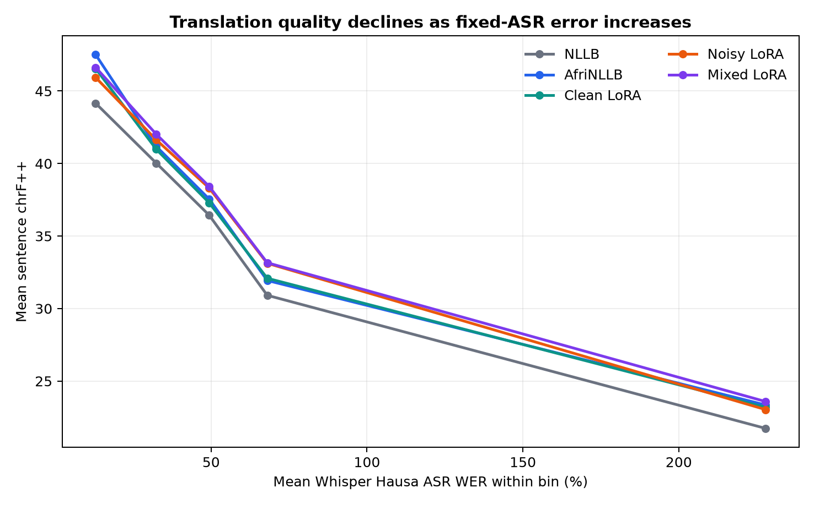

# Verified GPU error-aware MT experiment

## Research question and scope

This experiment asks whether Hausa→English machine translation becomes more
robust when it is adapted to the errors produced by the project's fixed Hausa
ASR model. Its evaluated graph is:

```text
Hausa audio → fixed Whisper Hausa ASR → Hausa text → MT system → English
```

The five compared systems all receive the same **Whisper-produced Hausa text**.
This is an error-aware text-MT benchmark, not a direct speech-to-text translation
benchmark. In particular, it is not numerically comparable with C1's direct
`Hausa audio → SpeechEncoderDecoderModel → English` development evaluation.

The benchmark contains all 1,500 renditions in 500 alignment clusters from the
official NaijaS2ST `dev` split, spoken by six speakers. Official `dev` was kept
out of training and internal validation, then observed for this completed final
evaluation. It is therefore no longer an untouched holdout for future tuning;
a new independent holdout is required for future model selection.

## Conditions and leakage controls

The three LoRA conditions use the same NLLB-600M base, seed 42, 12,828 training
examples, 1,425 noisy internal-validation examples, three epochs, effective
batch size 8, learning rate 2e-4, maximum length 256, and rank-16 LoRA:

- **Clean:** every MT source is the gold Hausa transcript.
- **Noisy:** every MT source is the fixed Whisper Hausa ASR transcript.
- **Mixed:** 6,414 clean and 6,414 noisy sources, with equal total exposure.

NaijaS2ST can contain multiple recordings of the same underlying bilingual
sentence. The corrected split first groups rows by `alignment_id`, verifies
that each alignment maps to exactly one `(hausa_gold, english_ref)` pair, then
joins different alignments that share the same exact bilingual pair into a
connected component. Seeded assignment operates on whole components.

The private authoritative input contained 14,253 rows, 4,751 alignment
clusters, and 4,749 components. Two exact bilingual pairs connected otherwise
distinct alignment IDs. The final split has zero alignment overlap and zero
exact bilingual-text overlap. Train and internal validation also each have zero
alignment overlap with official `dev`.

Only membership hashes are public:

| Split | Rows | Alignments | Speakers | Membership SHA-256 |
|---|---:|---:|---:|---|
| Train | 12,828 | 4,276 | 60 | `494f842886377edb3a4468acfc247dd5eae441aca445ec272f50d9eb51dc268b` |
| Internal validation | 1,425 | 475 | 57 | `9f3c657f50f1823b48c1ddf64583088c32e9d37bc1c9d8f196d95c0814f5a1ba` |

The algorithm is SHA-256 over newline-delimited, lexically sorted UTF-8
`utterance_id` values. The IDs themselves remain private. Regenerating the
split from the private authoritative ASR manifest reproduces both original
JSONL file hashes byte-for-byte.

## Official-dev results

Scores below are the canonical full-precision values in
[`evaluation_metrics.json`](../artifacts/gpu-handoff/evaluation_metrics.json).
Higher is better.

| System | BLEU | chrF++ | SSA-COMET |
|---|---:|---:|---:|
| NLLB | 13.3322 | 37.5055 | 0.44461 |
| AfriNLLB | 14.2134 | 38.2689 | 0.44935 |
| Clean LoRA | 14.2070 | 38.3082 | 0.44687 |
| Noisy LoRA | 15.2560 | 39.1234 | **0.46629** |
| Mixed LoRA | **15.3625** | **39.3631** | 0.46302 |

Mixed has the highest BLEU and chrF++ **point estimates**; noisy has the
highest SSA-COMET **point estimate**. The predeclared analysis did not save a
direct noisy-versus-mixed paired comparison, so these point estimates do not
support a statistical-superiority claim between noisy and mixed. Any future
direct comparison must be identified as post hoc, exploratory, and outside the
predeclared analysis.

### Predeclared paired cluster-bootstrap deltas against NLLB

The same sampled `alignment_id` clusters were used for each paired difference.
There were 1,000 replicates.

| System − NLLB | Metric | Mean delta | 95% cluster-bootstrap interval |
|---|---|---:|---:|
| AfriNLLB | BLEU | +0.884 | [+0.225, +1.509] |
| AfriNLLB | chrF++ | +0.767 | [+0.321, +1.251] |
| AfriNLLB | SSA-COMET | +0.0047 | [+0.0011, +0.0081] |
| Clean LoRA | BLEU | +0.878 | [+0.387, +1.351] |
| Clean LoRA | chrF++ | +0.809 | [+0.439, +1.195] |
| Clean LoRA | SSA-COMET | +0.0022 | [−0.0008, +0.0051] |
| Noisy LoRA | BLEU | +1.925 | [+1.248, +2.578] |
| Noisy LoRA | chrF++ | +1.626 | [+1.136, +2.090] |
| Noisy LoRA | SSA-COMET | +0.0217 | [+0.0171, +0.0260] |
| Mixed LoRA | BLEU | +2.043 | [+1.413, +2.699] |
| Mixed LoRA | chrF++ | +1.869 | [+1.402, +2.332] |
| Mixed LoRA | SSA-COMET | +0.0184 | [+0.0148, +0.0222] |

Thus noisy and mixed both improve over base NLLB on all three predeclared
paired measures. These intervals represent uncertainty from sampling the 500
evaluation clusters. They do **not** represent training-seed variability.

## Gold-Hausa oracle

Replacing fixed-ASR Hausa with gold Hausa, without changing the MT systems,
shows the remaining cost of upstream ASR errors:

| System | BLEU | chrF++ |
|---|---:|---:|
| NLLB | 28.8034 | 52.1398 |
| AfriNLLB | 31.5291 | 54.3423 |

These are oracle inputs, not another deployable speech-translation system.

## ASR-error and training diagnostics

Across systems, WER has a modest negative utterance-level correlation with
sentence chrF++ (`r` from −0.106 to −0.128). Substitution rate is more strongly
negative (`r` from −0.278 to −0.321) than deletion or insertion rate. The
aggregate WER-bin plot shows the same broad pattern: translation quality falls
as fixed-ASR error rises. It contains five aggregate bins per system, not
row-level points.



Final train/evaluation losses were:

| Condition | Train loss | Noisy-validation loss | Runtime |
|---|---:|---:|---:|
| Clean | 1.2948 | 2.3761 | 1,520.9 s |
| Noisy | 2.1376 | 2.1032 | 1,469.5 s |
| Mixed | 1.7555 | 2.1468 | 1,473.4 s |

Losses are optimization diagnostics, not direct translation-quality rankings.
This is a single-training-seed experiment; another training seed could change
the condition ordering.

## Empty-output disclosure

The authoritative prediction table contains one malformed-ASR case. NLLB,
AfriNLLB, clean, and noisy emitted genuine empty hypotheses; mixed emitted
`What?`. CSV loading preserves these four empty strings and includes them in
scoring. The row's identifier, speaker, source, reference, and other predictions
remain private.

## Immutable resources and historical enforcement

| Resource | Resolved revision |
|---|---|
| `McGill-NLP/NaijaS2ST` | `898f51582750fe244693794f22e3f4b32c5baf95` |
| `nahomazmach/whisper-small-ha` | `c4e2b47d88ae8b3ee0a605e09863b93aafca72e3` |
| `facebook/nllb-200-distilled-600M` | `f8d333a098d19b4fd9a8b18f94170487ad3f821d` |
| `AfriNLP/AfriNLLB-12enc-12dec-full-ft` | `53b1bf8d09454d092a474a8e78d5c95a32b53154` |
| `facebook/nllb-200-3.3B` | `1a07f7d195896b2114afcb79b7b57ab512e7b43e` |
| `McGill-NLP/ssa-comet-mtl` | `6e64e0a56ce69524c67f304b092725687a362ef8` |

The Hub revisions listed here were resolved and captured for the completed run;
the original load commands did not enforce immutable revisions. The updated
repository now makes future revision pinning explicit. SSA-COMET is resolved
with a revision-pinned Hub snapshot before COMET loads its local checkpoint.

## Recovery provenance

The completed benchmark used base Git commit
`8752d0d220b2ece8a81e572fd8134fb4e1a3b8df` plus a recorded local recovery
patch. It was not produced by the clean commit alone.

The deterministic recovery bundle SHA-256 is
`5d3bede898da681fd33f1f6483dd17c4e9109a29600f589a361dbb8565171931`.
It covers the LF-normalized full-index binary diff for six tracked recovery
files plus the LF-normalized executed supervisor snapshot. The recovery added
Transformers-4 tokenizer-metadata compatibility, explicit repeatable preflight
paths, connected-component splitting, metadata-only dataset projection,
empty-hypothesis preservation, a COMET/Setuptools compatibility pin, and staged
supervision. Repository-relative changed-file names are recorded in
[`provenance.json`](../artifacts/gpu-handoff/provenance.json).

The completed COMET analysis used `unbabel-comet==2.2.7`; its TorchMetrics
dependency still imports `pkg_resources`, so the isolated analysis requirements
pin `setuptools<81`. Training and COMET analysis environments remain separate.

## Authoritative raw-artifact contract

Only hashes are published; the raw files are not.

| Logical artifact | SHA-256 |
|---|---|
| Whisper-input prediction suite | `61ebe4bc29a5a63689aec28ff93452ec505ee81600866822040a1fbe63efe1a0` |
| Gold-Hausa oracle suite | `1a014576359a5fdb828edefbc589ce811309118fddcd8886e310339d016e8390` |
| System metrics | `fb2cc584b2edd806e158c0daeeb828d011cf8971036f07d7ad4b35c9483b07eb` |
| Paired differences | `c345940af76571cc6669a3d7d90e268c8b3caccdd959300673732c6879209f2e` |
| Train ASR manifest | `de7fc7bebfbf8d48e6dcae560e799a804b631b1e0378a3ece382f13768798a0e` |
| Research train manifest | `0d360ae91d81a48b1edbb5b37cabb16b451528462adc2042fc4e35607d90dbfb` |
| Research validation manifest | `def8ee94b95ced618cf010491fcb2eda20dc7c5e562a714b3c84cf1045cfcab0` |
| Dev ASR manifest | `61bfccc0a597f73264c829f04875201faccb75887d74621d14569638a0dc2ebc` |

`scripts/build_gpu_handoff_artifacts.py` verifies all eight hashes, independently
recomputes corpus BLEU and chrF++ with SacreBLEU 2.6.0, checks metric agreement,
validates scale/leakage/membership, and emits the safe package.
`scripts/validate_gpu_handoff_artifacts.py` then validates schema, privacy, and
cross-file contracts without requiring private data.

## Privacy boundary and limitations

Checked artifacts contain only counts, metrics, intervals, aggregate
correlations/bins, revisions, sanitized environment fields, and hashes. Raw
predictions, references, ASR text, row-level metrics, qualitative examples,
speaker/utterance/alignment IDs, manifests, audio paths, checkpoints, adapters,
environments, caches, and full logs stay private.

Automatic metrics do not prove semantic or factual correctness. Private
qualitative examples exist for review but are intentionally not published. The
experiment has one training seed, and official `dev` has now been observed.
